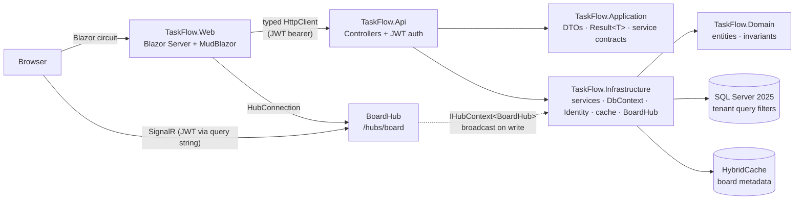

# TaskFlow

A multi-tenant Kanban board — organizations, projects, boards, drag-and-drop cards, live-synced
across every open tab via SignalR. Built as the second of three .NET portfolio projects (after
[BookIt](https://github.com/kuki404/BookIt)), reusing the same architecture and standards.

Built to demonstrate: multi-tenant EF Core (global query filters, denormalized tenant keys),
JWT auth with refresh-token rotation and reuse detection, resource-based RBAC (per-project
Owner/Member/Viewer), optimistic concurrency, SignalR real-time updates, and a Blazor Server +
MudBlazor front end — all on official Microsoft NuGet packages, plus two named exceptions:
**MudBlazor** (UI kit) and **Mapster** (DTO → view-model mapping).

## Try it in 60 seconds

```bash
git clone https://github.com/kuki404/TaskFlow.git && cd TaskFlow
cp .env.example .env
docker compose up -d --build
```

Open **http://localhost:5233**, click **Log in**, then any of the three demo buttons — two
tenants (**Acme Inc**, **Globex Corp**), each with an **Owner** and a **Member** account, seeded
automatically on first run so you can see multi-tenancy and RBAC without typing anything.

Nothing to register, no cloud account, no API keys: the placeholder values in `.env.example` are
valid as they stand, so a fresh clone runs offline. Replace them with your own before doing
anything beyond a local try — see [Configuration and secrets](#configuration-and-secrets).

## Architecture



No repository layer: `TaskFlow.Infrastructure/Services` talks to `TaskFlowDbContext` directly and
projects straight into `TaskFlow.Application` DTOs — the `DbSet` already *is* a repository and the
`DbContext` already *is* a unit of work.

## Multi-tenancy

Every tenant-scoped table (`Project`, `Board`, `CardList`, `Card`) carries a denormalized
`TenantId` column and an EF Core global query filter comparing it against the current tenant
(`TaskFlowDbContext.OnModelCreating`). `TenantId` is denormalized directly onto `Board`/`CardList`/
`Card` — not just `Project` — so filtering never needs a join back up the hierarchy; the tradeoff
is a few extra bytes per row for filters that stay cheap and index-friendly as the tree gets
deeper.

**The current tenant comes from exactly one place: the `tenant_id` claim on the validated JWT**
(`ICurrentTenantProvider` → `CurrentTenantProvider`, reading `IHttpContextAccessor`), set once at
token-issue time from the authenticated user's own `TenantId` column. It is never read from a
header, query string, or route value — a client cannot ask to see another tenant's data by
supplying a different id anywhere in the request.

Proven with a real integration test (`MultiTenancyTests.cs`) and against the live stack:

```
$ curl .../api/projects -H "Authorization: Bearer <Acme owner token>"
{"items":[{"name":"Kanban Launch Board", ...}], "totalCount":1, ...}

$ curl .../api/projects -H "Authorization: Bearer <Globex owner token>"
{"items":[{"name":"Product Roadmap", ...}], "totalCount":1, ...}
```

Each tenant sees only its own project — not a 403, an **empty/absent result**, so a valid token
for one tenant can't even confirm another tenant's data exists.

## SignalR

One hub, `BoardHub` at `/hubs/board`, `[Authorize]`'d. `JoinBoardAsync(boardId)` separately checks
the caller is a `ProjectMember` of that board's project *before* adding them to the SignalR group
— a hub method is an endpoint just like a controller action, so group membership alone is not
authorization. Every card/list mutation (`BoardsController` → `BoardService`) broadcasts a
`BoardChanged` event to the board's group via `IHubContext<BoardHub>` after a successful save; the
Blazor client (`Board.razor`) holds one `HubConnection` per board page, reconnects automatically,
and reloads on any incoming event.

Verified live: moving a card via `PUT /api/boards/{id}/cards/{id}/move` and re-fetching the board
confirms the move landed (see [EF Core & performance](#ef-core--performance) for the exact SQL);
the same request over a second authenticated connection to the hub receives the `BoardChanged`
broadcast in real time.

## Security

| Concern | How it's handled |
|---|---|
| Brute-force login | `SignInManager.CheckPasswordSignInAsync(..., lockoutOnFailure: true)` — 5 failed attempts locks the account 15 minutes |
| Stolen refresh token | Rotated on every use; **reuse of an already-rotated token revokes every active session for that user** (`AuthService.RefreshAsync`) |
| Cross-tenant data access | EF Core global query filters keyed off a JWT claim only — see [Multi-tenancy](#multi-tenancy) |
| Brute-force / abuse generally | `/api/auth/*` rate-limited to 5 requests/min/IP; everything else to 200/min/IP |
| New endpoint added without thinking about auth | `FallbackPolicy = RequireAuthenticatedUser()` — locked by default |
| Per-project permissions | Resource-based `IAuthorizationHandler` checks the caller's actual `ProjectMember.Role` against the route's project/board — Owner can delete the project, Member can CRUD cards, Viewer is read-only, all enforced server-side (`ProjectRoleAuthorizationHandler.cs`) |
| Errors leaking internals | Every unhandled exception → RFC 9457 `ProblemDetails` with a `traceId`, never a stack trace |
| Forged/weak JWTs | Pinned to `HmacSha256` only; refuses to start if `Jwt:Secret` is under 256 bits |

## EF Core & performance

- **SQL-side projection**: card/board reads project straight into DTOs via static
  `Expression<Func<TEntity,TDto>>` fields (`TaskFlow.Application/Mapping`) — EF Core translates
  these to a `SELECT` column list, never "load the entity, map in C# after."
- **`AsSplitQuery()`** for the Board → CardLists → Cards hierarchy — avoids the row-multiplication
  a single joined query would produce across two nested one-to-many collections. Real SQL captured
  from a running container (`docker logs taskflow-api`), showing the split into two queries plus
  the tenant filter applied automatically to every one of them:
  ```sql
  -- query 1: this board's lists
  SELECT [c1].[Id], [c1].[BoardId], [c1].[Name], [c1].[Position], [c1].[TenantId], [b0].[Id]
  FROM (
      SELECT TOP(1) [b].[Id] FROM [Boards] AS [b]
      WHERE [b].[TenantId] = @ef_filter__TenantId AND [b].[Id] = @boardId
  ) AS [b0]
  INNER JOIN (
      SELECT [c].[Id], [c].[BoardId], [c].[Name], [c].[Position], [c].[TenantId]
      FROM [CardLists] AS [c] WHERE [c].[TenantId] = @ef_filter__TenantId
  ) AS [c1] ON [b0].[Id] = [c1].[BoardId]
  ORDER BY [b0].[Id], [c1].[Position], [c1].[Id]

  -- query 2: this board's cards (separate round trip — AsSplitQuery)
  SELECT [c2].[Id], [c2].[AssignedUserId], [c2].[CardListId], ..., [c2].[Title]
  FROM (...) AS [b0]
  INNER JOIN (...) AS [c1] ON [b0].[Id] = [c1].[BoardId]
  INNER JOIN (
      SELECT [c0].[Id], ... FROM [Cards] AS [c0] WHERE [c0].[TenantId] = @ef_filter__TenantId
  ) AS [c2] ON [c1].[Id] = [c2].[CardListId]
  ORDER BY [b0].[Id], [c1].[Position], [c1].[Id], [c2].[Position]
  ```
- **`EF.CompileAsyncQuery`** for the full board load (`CompiledQueries.BoardByIdWithListsAndCards`)
  — the single hottest query in the app, re-run on every board view and every SignalR join check.
- **Optimistic concurrency**: `Card.RowVersion` is a SQL Server `rowversion` (`IsRowVersion()`).
  Two concurrent edits/moves of the same card race; the loser gets
  `DbUpdateConcurrencyException`, caught in `BoardService` and returned as a typed `Conflict`
  result → **409**, surfaced in the Blazor board as "changed by someone else, reload" instead of a
  crash or a silent overwrite. Proven in `ConcurrencyAndPaginationTests.TwoConcurrentCardUpdates_SecondOneConflicts`.
- **Filtered composite indexes** matching real predicates: `(TenantId, ProjectId)` on `Project`,
  `(BoardId, Position)` on `CardList`, `(CardListId, Position)` on `Card`, a unique
  `(ProjectId, UserId)` on `ProjectMember` (the hottest query in the app — checked on nearly every
  board write) — see comments in `TaskFlow.Infrastructure/Configurations/*.cs`.
- **`HybridCache`** fronts board *metadata* (list names/positions) only — cards move far too often
  to benefit from caching and are always read fresh. Tag-invalidated (`board:{id}`) on any list
  create/rename/move/delete.
- **Server-enforced paging**: `PagedRequest.PageSize` is capped at 100 — `?pageSize=99999` is a
  `400`, not a truncated response. `AddDbContextPool` reuses `DbContext` instances instead of
  allocating one per request.

## Frontend

- Custom **violet/amber** MudBlazor theme (BookIt uses teal/indigo) with a dark/light toggle,
  defaulting to the OS preference and persisted via `ProtectedLocalStorage`.
- Session survives a hard refresh: the JWT is mirrored into `ProtectedSessionStorage`, restored on
  the circuit's first render (`AuthSession.cs`).
- Skeleton loading states, empty states with a call to action, page-level `ErrorBoundary`.
- Accessibility: skip-to-content link, `aria-label` on icon-only buttons, keyboard-navigable.
- SEO: per-page `<PageTitle>`, `robots.txt` disallowing everything (every page requires auth),
  empty `sitemap.xml`, `noindex` meta tag on every page.
- Board page: HTML5 drag-and-drop moves cards between lists via the move API; a `RowVersion`
  conflict surfaces as a dismissible warning instead of silently failing.

## Project layout

```
src/
  TaskFlow.Domain/          Entities, enums, rich domain methods — no EF Core dependency
  TaskFlow.Application/     DTOs, Result<T>/PagedResult<T>, service contracts, SQL-projection
                             expressions — no EF Core dependency either
  TaskFlow.Infrastructure/  DbContext, migrations, service implementations (DbContext injected
                             directly — no repositories), Identity, JWT issuing, HybridCache,
                             BoardHub (SignalR)
  TaskFlow.Api/              Controllers, JWT/rate-limiting/CORS/ProblemDetails wiring,
                             resource-based authorization, health checks, SignalR hub mapping
  TaskFlow.Web/              Blazor Server + MudBlazor + Mapster view-models, typed HttpClient,
                             SignalR client
tests/
  TaskFlow.UnitTests/        Domain invariant tests (Card/Board/CardList) — xUnit
  TaskFlow.IntegrationTests/ WebApplicationFactory tests against a real SQL Server (xUnit),
                             ALL sharing one ICollectionFixture — auth flow, lockout, refresh
                             reuse detection, multi-tenant isolation, resource-based 403s,
                             optimistic-concurrency conflicts, pagination cap
```

Central Package Management (`Directory.Packages.props`) pins every NuGet version in one place;
`Directory.Build.props` turns on .NET analyzers solution-wide with warnings treated as errors.

## Prerequisites

- .NET 10 SDK
- Docker Desktop
- `dotnet-ef` global tool: `dotnet tool install --global dotnet-ef`

## Configuration and secrets

Exactly **two** secrets, neither committed to git:

| Secret | What it is | Rules |
|---|---|---|
| `MSSQL_SA_PASSWORD` | Password for the SA account of your local SQL Server container | SQL Server policy: 8+ characters using upper case, lower case, digits and symbols |
| `JWT_SECRET` | Key this API signs its own tokens with | At least 32 characters (256 bits) — the API refuses to start below that |

Generate real values with:

```bash
openssl rand -base64 24   # MSSQL_SA_PASSWORD
openssl rand -base64 48   # JWT_SECRET
```

**No cloud account is involved anywhere.** The API issues and validates its own JWTs with
HMAC-SHA256 — `JWT_SECRET` is just a random string you invent, and auth works fully offline.
Nothing to register with Microsoft, Azure AD, or Entra ID.

| How you run it | Reads secrets from | How to set them |
|---|---|---|
| `docker compose up` | `.env` in the repo root | `cp .env.example .env`, then edit |
| `dotnet run` locally | [User Secrets](https://learn.microsoft.com/aspnet/core/security/app-secrets) | `dotnet user-secrets set ...` (below) |
| GitHub Actions | Repository secrets | `gh secret set MSSQL_SA_PASSWORD` / `gh secret set JWT_SECRET` |
| Azure DevOps | Library variable group `taskflow-ci-secrets` | Pipelines → Library, padlock each variable |

## First-time setup (running locally with `dotnet run`)

1. Copy `.env.example` to `.env` (placeholders work as-is for a quick try).
2. Start the database: `docker compose up -d db`
3. Point the apps at your own secrets:
   ```bash
   dotnet user-secrets set "Sql:Password" "<same password as MSSQL_SA_PASSWORD>" --project src/TaskFlow.Api
   dotnet user-secrets set "Jwt:Secret" "<same value as JWT_SECRET>" --project src/TaskFlow.Api
   ```
4. Migrations apply automatically on startup (or run manually):
   ```bash
   dotnet ef database update --project src/TaskFlow.Infrastructure --startup-project src/TaskFlow.Api
   ```
5. Run both apps (separate terminals):
   ```bash
   dotnet run --project src/TaskFlow.Api    # http://localhost:5099
   dotnet run --project src/TaskFlow.Web    # http://localhost:5233
   ```

Seeded demo logins (also one-click buttons on the Login page), all password **Demo123!**:
`owner@acme.local`, `member@acme.local`, `owner@globex.local`.

## Running fully in Docker

```bash
docker compose up -d --build
```

Builds and starts all three services — `db`, `api`, `web` — each with a `HEALTHCHECK`
(`/health/ready` on the Api, `/health` on Web) so `depends_on: condition: service_healthy` actually
waits for the app to serve traffic. SDKs are pinned to an exact patch (`10.0.302`), not the
floating `10.0` tag — a later SDK patch was found to silently drop the Blazor Server client runtime
from a multi-project publish with no build error.

## Tests

```bash
docker compose up -d db          # integration tests need a live SQL Server
dotnet test
```

22 tests (12 unit + 10 integration), all passing against a real dockerized SQL Server:
domain invariant tests, full auth flow, account lockout, refresh-token reuse detection, multi-tenant
isolation (empty result, not 403), resource-based 403 (Viewer denied write, Owner-only project
deletion), optimistic-concurrency conflict (two concurrent card updates → one 409), and the
server-enforced pagination cap — all against a separate `TaskFlow_IntegrationTests` database,
sharing one `ICollectionFixture` per BookIt's own retrofit (two separate fixtures previously raced
seeding the same database).

## CI/CD

Both pipelines run the same stages — restore → build → unit tests → integration tests against a
real SQL Server service container:

- **`.github/workflows/ci.yml`** — GitHub Actions.
- **`azure-pipelines.yml`** — Azure DevOps YAML.

**Neither runs automatically** (`workflow_dispatch` / `trigger: none`) and **neither contains a
password** — both read `MSSQL_SA_PASSWORD`/`JWT_SECRET` from their platform's secret store. A
`preflight` job/stage fails with a readable message if those secrets were never configured.

To enable the GitHub workflow on your own fork:

```bash
gh secret set MSSQL_SA_PASSWORD
gh secret set JWT_SECRET
```

Then uncomment the `push:`/`pull_request:` block at the top of `.github/workflows/ci.yml`.

## Notes

- The SQL Server image is `amd64`; on Apple Silicon it runs emulated via Rosetta — expect a slower
  cold start. `EnableRetryOnFailure()` smooths over transient connection hiccups.
- The database only listens on `127.0.0.1:1434` (not the default 1433, to avoid clashing with
  BookIt's own db container if both run simultaneously) — never exposed to the local network.
- No repository/wrapper hides `IQueryable` anywhere in `Infrastructure/Services` — every service
  method is a real, inspectable LINQ query.
