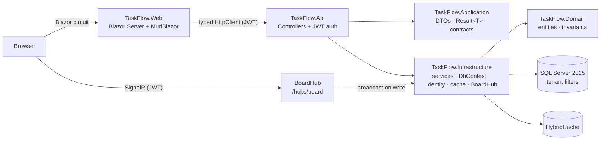

# TaskFlow

> A multi-tenant Kanban board — organizations, projects, boards, drag-and-drop cards, live-synced
> across every open tab via SignalR.

A portfolio project (second of three, after [BookIt](https://github.com/kuki404/BookIt))
demonstrating the two things that make a SaaS board hard: strict tenant isolation and real-time
collaboration that stays authorized.

**Stack:** .NET 10 · ASP.NET Core Web API · EF Core 10 + SQL Server 2025 · ASP.NET Core Identity +
JWT · SignalR · HybridCache · Blazor Server + MudBlazor · Docker Compose · xUnit. Official
Microsoft packages throughout, with two deliberate exceptions: MudBlazor (UI) and Mapster (DTO
mapping).

## Run it

```bash
git clone https://github.com/kuki404/TaskFlow.git && cd TaskFlow
cp .env.example .env
docker compose up -d --build
```

Open **http://localhost:5233**, click **Log in** and pick any of the three demo buttons — two
tenants (**Acme Inc**, **Globex Corp**), each with an **Owner** and a **Member**, seeded on first
run so you can see multi-tenancy and RBAC with no typing. Runs fully offline: the `.env.example`
placeholders are valid as-is, no cloud account or API keys. A fresh clone always gets a fresh
database (the SQL Server volume is created empty and migrated + seeded on startup);
`docker compose down -v` resets it.

## What it demonstrates

**Multi-tenancy that can't be bypassed** — every tenant-scoped table carries a denormalized
`TenantId` with an EF Core global query filter, so isolation needs no joins up the hierarchy. The
current tenant comes from exactly one place: the `tenant_id` claim on the validated JWT — never a
header, query string, or route value, so a client can't ask to see another tenant's data. A valid
token for one tenant gets an **empty result** for another tenant's data, not a `403` that would
even confirm it exists. Proven with an integration test.

**Real-time that stays authorized** — one `[Authorize]`'d `BoardHub`; `JoinBoardAsync` separately
verifies the caller is a `ProjectMember` of that board *before* adding them to the SignalR group
(a hub method is an endpoint too — group membership is not authorization). Every card/list mutation
broadcasts a named event to the board's group via `IHubContext<BoardHub>` after a successful save;
the Blazor client reloads on any of them. Verified live with a second real `HubConnection`.

**Security — on by default:**

| Concern | Handling |
|---|---|
| Brute-force login | Account locks for 15 min after 5 failed attempts |
| Stolen refresh token | Rotated on every use; reusing a rotated token revokes **every** session for that user |
| Per-project permissions | Resource-based RBAC — `Owner > Member > Viewer` checked against real `ProjectMember` rows server-side; a Viewer can't mutate a card no matter what the client sends |
| Endpoint added without an auth decision | `FallbackPolicy = RequireAuthenticatedUser()` — locked by default |
| Leaked internals | Every unhandled exception → RFC 9457 `ProblemDetails` with a `traceId` |
| Forged/weak JWTs | Pinned to `HmacSha256`; refuses to start if `Jwt:Secret` is under 256 bits |

**EF Core:** optimistic concurrency on card moves (`409` on conflicting drag), SQL-side projection
into DTOs, `HybridCache` on board metadata. **No repository layer** — services talk to `DbContext`
directly and project into DTOs.

## Architecture



```
src/
  TaskFlow.Domain/          Entities, invariants — no framework dependency
  TaskFlow.Application/     DTOs, Result<T>/PagedResult<T>, contracts, projections
  TaskFlow.Infrastructure/  DbContext (tenant filters), migrations, services, Identity, JWT, cache, BoardHub
  TaskFlow.Api/             Controllers, auth/rate-limit/ProblemDetails wiring, RBAC handler, health checks
  TaskFlow.Web/             Blazor Server + MudBlazor, one HubConnection per board
tests/
  TaskFlow.UnitTests/        Domain invariant tests
  TaskFlow.IntegrationTests/ Tenant isolation, RBAC 403s, concurrency conflicts, auth flow
```

## Tests

```bash
docker compose up -d db     # integration tests run against a real SQL Server
dotnet test
```

Includes the cross-tenant isolation proof as an automated test, against a separate
`TaskFlow_IntegrationTests` database (never touches dev data).

## Configuration

Two secrets, neither committed to git: `MSSQL_SA_PASSWORD` (local SQL Server SA account) and
`JWT_SECRET` (token signing key, 32+ chars). `docker compose` reads them from `.env` (gitignored,
copied from `.env.example`); running via `dotnet run` reads them from
[User Secrets](https://learn.microsoft.com/aspnet/core/security/app-secrets). Generate real ones
with `openssl rand -base64 24` / `48`. No external identity provider — the API signs and validates
its own JWTs, fully offline.

To run without Docker: `docker compose up -d db`, set the two values via `dotnet user-secrets`,
then `dotnet run --project src/TaskFlow.Api` (:5186) and `src/TaskFlow.Web` (:5110). CI for
GitHub Actions ([`.github/workflows/ci.yml`](.github/workflows/ci.yml)) and Azure DevOps
([`azure-pipelines.yml`](azure-pipelines.yml)) is included — manual-trigger and secret-free.
